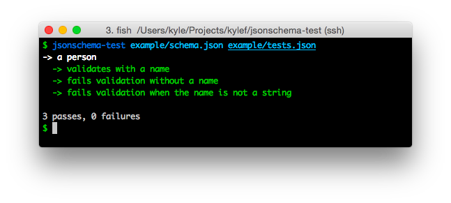

# JSON Schema Testing

[](https://travis-ci.org/kylef/jsonschema-test)

jsonschema-test is a tool which for running tests against a JSON Schema.



## Installation

```
pip install jsonschema-test
```

## Usage

To use jsonschema-test, you will need to write a collection of tests.
The tests are decoupled from any language and are written in JSON.

### Example

#### Test Suite

A test suite is a collection of test's and test cases. See
the [test suite structure](#test-suite-structure) for more information

```json
[
    {
        "description": "a person",
        "tests": [
            {
                "description": "validates with a name",
                "data": {
                    "name": "Kyle"
                },
                "valid": true
            },
            {
                "description": "fails validation without a name",
                "data": {
                },
                "valid": false
            }
        ]
    }
]
```

#### Schema

A JSON Schema to test.

```json
{
    "type": "object",
    "properties": {
        "name": {
            "type": "string"
        }
    },
    "required": [ "name" ]
}
```

#### Running the tests

```
jsonschema-test example/schema.json example/tests.json
```

## Test Suite Structure

There is a [JSON Schema](jsonschema_test/schema.json) file for the test suite structure.

### Suite

A test suite is a logical group of Test's. It's a simple JSON file with an
array containing each test.

### Test

#### Properties

- `description` (string, required) - A short description of what this test tests.
- `tests` (array[Case], required) - A collection of test cases.

### Case

#### Properties

- `description` (string, required) - The description of this test case.
- `data` (any, required) - The JSON used against the JSON Schema.
- `valid` (boolean, required) - If the `data` should validate or not.

## License

jsonschema-test is released under the BSD license. See [LICENSE](LICENSE).

